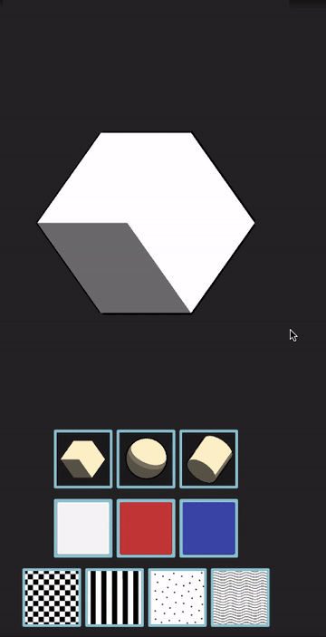

# Shape Browser

**Shape Browser** is a little Unity/C# Android mobile game I developed to show out to setup a basic asset storage using the [Unity Cloud Content Delivery tool](https://docs.unity3d.com/Manual/UnityCCD.html), and also how to mix it with [Codemagic](https://unitycicd.com/).

The app in itself is pretty basic: it simply lets you pick one of the three available primitive shapes, change its colors and optionally set a texture.

*Note:* the game also works with mouse inputs to help with in-editor debugging! :)

